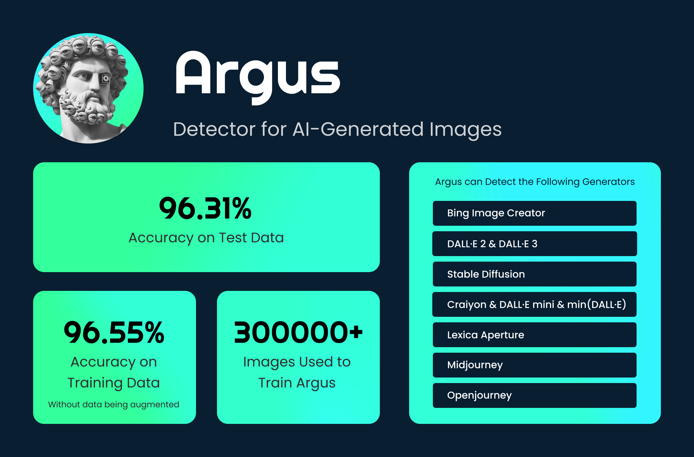

# SyntheticEye
Advanced AI-Face detector

SyntheticeEye is developing free and reliable detectors for AI-generated content.

## Models
### Aletheia

Aletheia is a machine learning model designed to detect AI-generated faces and distinguish them from real faces. This model can be used on our [website](https://syntheticeye.dev/#/aletheia). Aletheia has achieved high accuracy in detecting images from various face generators, but we are still working on improving this model further and making it more robust.

### Argus

Argus is our detector for AI-generated images in general. This model aims to detect a broad spectrum of AI-generated images. Argus can be tested on our [website](https://syntheticeye.dev/#/argus)

### Future Models
We are working on developing models, that are able to detect more types of content. These are a few detectors we want to develop in the future:
- Text Detection
- Audio Detection
- Video Detection

## Vision
With our models, we want to provide everybody with reliable, free, and user-friendly tools that help them detect AI-Generated Content. Our models help verify content and detect misinformation. With the rapid advancements of generative AI, tools like ours become essential to preserve trust.

## Repository Structure
- **assets/**: Storage for project-related images.
- **notebooks/**: Jupyter notebooks for our models.
  - **runs/**: Stores logs from notebooks. These are not included in the repo, to ensure a lightweight repository.
- **scripts/**: Contains primarily helper functions.
- **state_dicts/**: Here we store our models state_dicts temporarily. They are not included in the repo, due to their large file size.
- **documentation**: Contains model-specific requirements
  - **Aletheia**: Requirements for Aletheia.
  - **Argus** Requirements for Argus.

## Tools
Test our models on our website at [syntheticeye.dev](https://syntheticeye.dev/)

Use our models directly in the browser with our [chrome extension](https://chromewebstore.google.com/detail/jhnehjooeiopekmlgcpmdmliifccjhlj)
