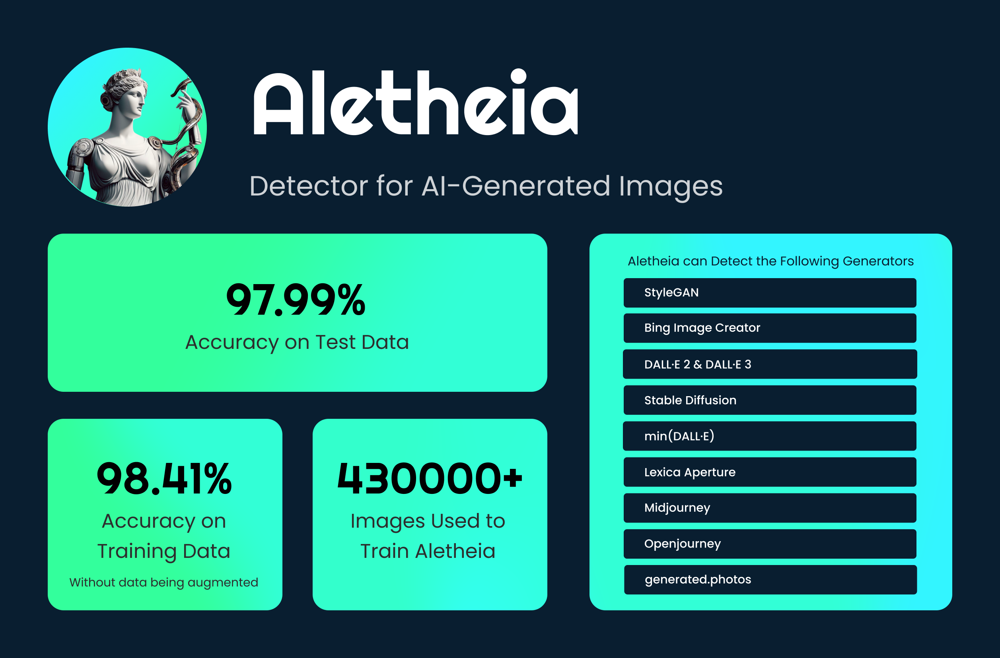

# SyntheticEye
Advanced AI-Face detector

SyntheticeEye is developing free-to-use and reliable detectors for AI-generated content. As generative AI advances, tools like ours become essential to combat misinformation.

## Models
### Aletheia

Aletheia is a machine learning model designed to detect AI-generated faces and distinguish them from real faces. This model can be used on our [website](syntheticeye.dev). Aletheia has achieved high accuracy in detecting images from various face generators, but we are still working on improving this model further and making it more robust.

### Argus
We are currently developing Argus, a detector for AI-generated images in general, and hope to release it soon on our website. This model aims to detect a broad spectrum of AI-generated images.

### Future Models
We are continuously working on developing new models that are able to detect more types of content. These are a few detectors we plan to develop in the future:
- Text Detection
- Audio Detection
- Video Detection
